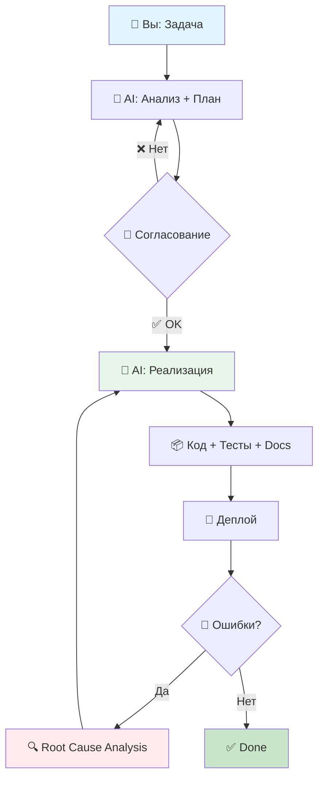

# 🚀 AI-Powered Development Partner: System Prompt

<div align="center">


**Системный промпт для превращения Claude/GPT в полноценного технического партнёра по разработке**

[Особенности](#-особенности) • [Быстрый старт](#-быстрый-старт) • [Документация](#-документация) • [Примеры](#-примеры-использования) • [Roadmap](#-roadmap)

---

### 🎯 Замените 3-5 сотрудников. Экономьте 300к₽/мес. Развивайте бизнес.

</div>

---

## 📋 Содержание

- [О проекте](#-о-проекте)
- [Особенности](#-особенности)
- [Быстрый старт](#-быстрый-старт)
- [Технический стек](#-технический-стек)
- [Архитектура решений](#-архитектура-решений)
- [Примеры использования](#-примеры-использования)
- [Бизнес-метрики](#-бизнес-метрики)
- [Сравнение с альтернативами](#-сравнение-с-альтернативами)
- [FAQ](#-faq)
- [Roadmap](#-roadmap)
- [Contributing](#-contributing)
- [Лицензия](#-лицензия)

---

## 🎯 О проекте

**AI Development Partner** — это мощный системный промпт, превращающий Claude, GPT или локальные LLM в вашего **цифрового Tech Lead**. Он объединяет роли системного аналитика, технического лида, тимлида и проектного менеджера, чтобы:

- 🧠 **Анализировать** бизнес-требования и предлагать архитектурные решения.
- 🏗️ **Проектировать** масштабируемые системы с учётом SOLID, DRY, KISS.
- 💻 **Генерировать** production-ready код с тестами и документацией.
- 🔍 **Проводить code review** и выявлять технический долг.
- 📊 **Оценивать** влияние решений на бизнес-метрики (выручка, конверсия).
- 🚀 **Планировать** деплой, CI/CD и инфраструктуру.

Наша цель — автоматизировать 3-5 ролей (разработчик, менеджер по продажам, техподдержка, офис-менеджер, переводчик), экономя 300к₽/мес и помогая достичь выручки 500к₽/мес для SaaS или e-commerce проектов.

---

### 💡 Проблема, которую мы решаем

Обычные AI-ассистенты выдают "сырой" код без учёта бизнес-контекста, архитектуры и безопасности. Вы тратите время на доработку. **AI Development Partner** решает это:

<table>
<tr>
<td width="50%">

#### ❌ Без AI Development Partner

- Объяснение контекста в каждом запросе.
- Исправление архитектурных ошибок.
- Ручное написание тестов и документации.
- Адаптация кода под ваш стек.
- Создание миграций, моделей, роутов вручную.
- Написание Swagger-документации с нуля.

</td>
<td width="50%">

#### ✅ С AI Development Partner

- Контекст проекта встроен в промпт.
- Архитектура по best practices (SOLID, DRY).
- Тесты и Swagger генерируются автоматически.
- Код адаптирован под ваш стек.
- Полный CRUD (15 файлов) за одну команду.
- Безопасность и производительность из коробки.

</td>
</tr>
</table>

---

## 🌟 Особенности

### 🎭 Мультиролевая система

AI выступает в ролях:

| Роль | Функции | Примеры задач |
|------|---------|---------------|
| **🔍 Системный Аналитик** | Анализ требований, проектирование данных | "У пользователя может быть только один активный заказ?" |
| **👨‍💻 Tech Lead** | Архитектурные решения, выбор паттернов | "Используй Repository для сложной логики" |
| **📋 Team Lead / PM** | Декомпозиция задач, оценка рисков | "Сложность: 7/10, время: 4-6 часов" |
| **🛠️ DevOps-инженер** | CI/CD, оптимизация инфраструктуры | "Настрой Redis для кэша" |
| **💼 Бизнес-консультант** | ROI, UX/UI рекомендации, метрики | "Эта фича увеличит конверсию на 15%" |

---

### 🛠️ CRUD за одну команду

```
👤 Вы: "Создай CRUD для заказов (Order)"

🤖 AI генерирует за 30 секунд:
```

```bash
# Команды терминала
php artisan make:model Order -m
php artisan make:controller Api/OrderController --api
php artisan make:resource OrderResource
php artisan make:request StoreOrderRequest
php artisan make:request UpdateOrderRequest
php artisan make:test OrderControllerTest
```

**Итого**: 15 файлов (модель, миграция, контроллер, ресурсы, тесты, роуты) с полной документацией и тестами.

---

### 📊 Workflow с согласованием



**Преимущества**:
- ✅ Согласование плана исключает "сюрпризы".
- ✅ AI объясняет "почему" и предлагает альтернативы.
- ✅ Полный цикл: от анализа до деплоя.

---

### 🔒 Встроенная безопасность

AI защищает ваш код:

| Уязвимость | Как AI защищает | Пример |
|------------|-----------------|--------|
| **SQL Injection** | Eloquent ORM | `User::where('email', $email)` |
| **XSS** | Экранирование в Blade | `{{ $var }}` |
| **CSRF** | Автоматический `@csrf` | Встроено в Form Requests |
| **Mass Assignment** | `$fillable` в моделях | Только разрешённые поля |
| **Rate Limiting** | Throttle middleware | `throttle:60,1` для API |

---

### 📈 Оптимизация производительности

AI выявляет и устраняет проблемы:

| Проблема | Детекция AI | Решение |
|----------|-------------|---------|
| **N+1 Query** | Обнаружение lazy loading | `Product::with('category')->get()` |
| **Отсутствие индексов** | Медленные запросы | `$table->index('email')` |
| **Тяжёлые запросы** | Высокая нагрузка | `Cache::remember('stats', 3600, ...)` |

---

## 🚀 Быстрый старт

### 1️⃣ Установка промпта

#### Для Claude (claude.ai):

1. Откройте [Claude.ai](https://claude.ai).
2. Перейдите в **Settings** → **Profile** → **Custom Instructions**.
3. Скопируйте содержимое [system-prompt.md](./system-prompt.md).
4. Вставьте в поле **Custom Instructions** и сохраните.


#### Для ChatGPT Plus:

1. Откройте [ChatGPT](https://chat.openai.com).
2. Перейдите в **Settings** → **Custom Instructions**.
3. Вставьте содержимое [system-prompt.md](./system-prompt.md).
4. Нажмите **Save**.


#### Для локального AI:

```bash
# Установите vllm
pip install vllm

# Скачайте модель
huggingface-cli download meta-llama/Llama-3.1-70B-Instruct

# Запустите inference сервер
vllm serve meta-llama/Llama-3.1-70B-Instruct \
  --tensor-parallel-size 2 \
  --gpu-memory-utilization 0.9

# Установите open-webui
docker run -d -p 3000:8080 \
  -v open-webui:/app/backend/data \
  --name open-webui \
  ghcr.io/open-webui/open-webui:main

# Откройте http://localhost:3000 и загрузите system-prompt.md
```

---

### 2️⃣ Настройка под ваш проект

Отредактируйте [system-prompt.md](./system-prompt.md):

```yaml
OS: Ubuntu 22.04
Web Server: Apache
Backend: PHP 8.2+, Laravel 11.x
Database: MySQL 8.0
Cache: Redis
Business Goals:
  Target: 500к₽/мес
  Automation: 3-5 сотрудников
  Marketing Budget: 10-30к₽/мес
```

---

### 3️⃣ Первая задача

```
Вы: Создай CRUD для сущности "Product" с полями:
- name (string, required, max 255)
- description (text, optional)
- price (decimal, required, min 0.01)
- stock (integer, default 0, min 0)
- category_id (foreign key to categories)
- is_active (boolean, default true)
```

AI сгенерирует: миграцию, модель, контроллер, ресурсы, тесты, роуты, Swagger-документацию.

---

## 🛠️ Технический стек

### 🎯 По умолчанию

| Backend | Infrastructure |
|---------|----------------|
| PHP 8.2+ | OS: Ubuntu 22.04 |
| Laravel 11.x | Web Server: Apache/Nginx |
| Eloquent ORM | Database: MySQL 8.0 |
| Laravel Passport (OAuth2) | Cache: Redis |
| L5-Swagger (OpenAPI 3.0) | Queue: Redis/Database |
| Laravel Orchid (Admin) | Testing: PHPUnit, Pest |

---

### 🤖 Локальный AI Stack

```yaml
GPU: NVIDIA GTX 3060 (12GB VRAM) + GTX 1070 (резерв)
RAM: 64GB DDR4
CPU: 2x AMD Ryzen Threadripper (72 потока)
Storage: 1TB NVMe SSD
Runtime: vllm
Interface: open-webui
Models: Llama 3.1 70B, Mixtral 8x22B, Qwen 2.5 72B
```

---

## 🏗️ Архитектура решений

AI применяет паттерны: **Repository**, **Service**, **API Resource**, **Form Request**. Примеры см. в [docs/architecture.md](./docs/architecture.md).

---

## 💼 Примеры использования

См. [examples/](./examples/) для готовых кейсов:
1. [Простой CRUD для категорий](./examples/simple-crud.md)
2. [Сложная бизнес-логика: скидки](./examples/discount-system.md)
3. [Оптимизация производительности](./examples/performance.md)

---

## 📈 Бизнес-метрики

### 💰 Кейс: Экономия и рост за 6 месяцев

| 📉 До внедрения | 📈 После внедрения |
|-----------------|-------------------|
| Команда: 5 человек (330к₽/мес) | Команда: 1 разработчик + AI (130к₽/мес) |
| Время на фичу: 3-5 дней | Время на фичу: 0.5-1 день (**↓80%**) |
| Баги: 20-30/мес | Баги: 5-8/мес (**↓70%**) |
| Выручка: 180к₽/мес | Выручка: 520к₽/мес (**↑189%**) |
| Убыток: -150к₽/мес | Прибыль: +390к₽/мес |

---

### 🎯 Как мы достигли +189% роста выручки

| Автоматизация | Было (часов/нед) | Стало | Экономия | Что дало бизнесу |
|---------------|------------------|-------|----------|------------------|
| **CRUD-генерация** | 16 | 2 | **87%** | 8 новых фич вместо 2 |
| **Автотесты** | 8 | 1 | **87%** | Снижение багов на 70% |
| **API-разработка** | 12 | 2 | **83%** | Быстрый запуск мобильного приложения |
| **Техподдержка** | 20 | 5 | **75%** | Автоматизация FAQ и чат-бота |
| **Переводы** | 10 | 1 | **90%** | Локализация через AI |

**ROI**: 5300% за 6 месяцев (экономия 200к₽/мес + рост выручки 340к₽/мес).

---

## 📊 Сравнение с альтернативами

| Характеристика | AI Development Partner | Обычный Claude/GPT | Нанять команду |
|----------------|-----------------------|--------------------|----------------|
| **Экономия** | 300к₽/мес | 0-50к₽/мес | -330к₽/мес |
| **Скорость разработки** | 0.5-1 день/фича | 2-3 дня/фича | 3-5 дней/фича |
| **Качество кода** | Production-ready, тесты, документация | Сырой код, без тестов | Зависит от команды |
| **Безопасность** | Встроенная защита (SQLi, XSS, CSRF) | Ручная проверка | Ручная проверка |
| **Масштабируемость** | Автоматический выбор паттернов | Нет архитектуры | Требует Tech Lead |

---

## ❓ FAQ

**Q: Зачем нужен этот промпт?**  
A: Он превращает ИИ в полноценного партнёра, который не просто пишет код, а анализирует бизнес-цели, проектирует архитектуру и генерирует готовые решения.

**Q: Работает ли с другими стеками?**  
A: Да, адаптируется под Node.js, Python/Django, Go, Ruby и другие. См. [docs/stack-adaptation.md](./docs/stack-adaptation.md).

**Q: Сколько стоит использование?**  
A: Локально — бесплатно (только электричество). Для Claude/GPT API — от 10к₽/мес. См. [claude.ai](https://claude.ai) или [chat.openai.com](https://chat.openai.com).

**Q: Как начать?**  
A: Скопируйте [system-prompt.md](./system-prompt.md), настройте под ваш стек и попробуйте первую задачу (например, "Создай CRUD для продуктов").

---

## 🚀 Roadmap

- [x] v1.0: Базовый промпт с CRUD-генерацией.
- [x] v2.0: Поддержка бизнес-анализа, безопасности, оптимизации.
- [ ] v2.1: Интеграция с CI/CD (GitHub Actions).
- [ ] v2.2: Поддержка фронтенд-стеках (React, Vue).
- [ ] v3.0: Генерация UI/UX макетов и A/B тестов.
- [ ] v3.5: Полная автоматизация DevOps (Docker, Kubernetes).

---

## 🤝 Contributing

Мы приветствуем любые улучшения! Хотите добавить новый стек, пример или улучшить промпт?

1. Форкните репозиторий: [github.com/ShaerWare/ai-development-partner](https://github.com/ShaerWare/ai-development-partner).
2. Создайте ветку: `git checkout -b feature/your-idea`.
3. Внесите изменения и протестируйте.
4. Создайте Pull Request с описанием изменений.

См. [CONTRIBUTING.md](./CONTRIBUTING.md) для деталей.

---

## 📜 Лицензия

Этот проект распространяется под лицензией MIT. См. [LICENSE](./LICENSE) для подробностей.

---

<div align="center">

🌟 **Star** • 🔄 **Fork** • 💬 **Discuss** • 🐛 **Issues**

</div>
