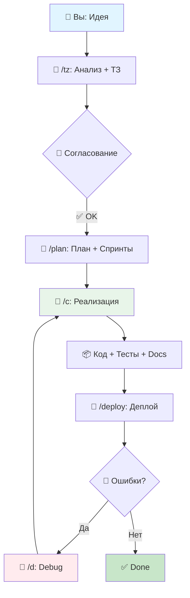

# 🚀 AI Development Partner: System Prompt

<div align="center">


**Системный промпт для превращения Claude/GPT в полноценного технического и бизнес-партнёра по разработке.**

[Особенности](#-особенности) • [Быстрый старт](#-быстрый-старт) • [Команды в действии](#-ключевые-команды-в-действии) • [Contributing](#-contributing) • [Roadmap](#-roadmap)

---

**### 🎯 Замените 3-5 сотрудников. Экономьте 300к₽/мес. Развивайте бизнес.**

</div>

---

## 📋 Содержание

- [О проекте](#-о-проекте)
- [Особенности](#-особенности)
- [Быстрый старт](#-быстрый-старт)
- [Ключевые команды в действии](#-ключевые-команды-в-действии)
- [Технический стек](#-технический-стек)
- [Бизнес-метрики](#-бизнес-метрики)
- [Сравнение с альтернативами](#-сравнение-с-альтернативами)
- [FAQ](#-faq)
- [Roadmap](#-roadmap)
- [Contributing](#-contributing)
- [Лицензия](#-лицензия)

---

## 🎯 О проекте

**AI Development Partner** — это мощный системный промпт, превращающий Claude, GPT или локальные LLM в вашего **цифрового партнёра по разработке**. Он объединяет роли системного аналитика, технического лида, тимлида, **проектного менеджера и бизнес-консультанта**, чтобы:

-   🧠 **Анализировать** бизнес-требования и формировать ТЗ (`/tz`).
-   🏗️ **Проектировать** масштабируемые системы и оценивать их стоимость (`/arch`, `/cost`).
-   💻 **Генерировать** production-ready код с тестами и документацией (`/c`).
-   🔍 **Проводить code review** и предлагать рефакторинг (`/review`, `/r`).
-   📊 **Планировать** разработку, разбивать на спринты и оценивать ROI (`/plan`, `/sprints`).
-   🚀 **Автоматизировать** задачи DevOps, от CI/CD до мониторинга (`/ci`, `/deploy`).

Наша цель — автоматизировать 3-5 ролей (разработчик, PM, техподдержка, аналитик), экономя **300к₽/мес** и помогая достичь выручки **500к₽/мес** для SaaS или e-commerce проектов.

---

### 💡 Проблема, которую мы решаем

Обычные AI-ассистенты выдают "сырой" код без учёта бизнес-контекста, архитектуры и безопасности. Вы тратите время на доработку. **AI Development Partner** решает это:

<table>
<tr>
<td width="50%">

**#### ❌ Без AI Development Partner**

-   Объяснение контекста в каждом запросе.
-   Исправление архитектурных ошибок.
-   Ручное написание тестов и документации.
-   Создание миграций, моделей, роутов вручную.
-   Отсутствие оценки рисков и стоимости.
-   Написание Swagger-документации с нуля.

</td>
<td width="50%">

**#### ✅ С AI Development Partner**

-   Контекст проекта встроен в промпт.
-   Архитектура по best practices (SOLID, DRY).
-   Полный CRUD (15+ файлов) за одну команду **`/c`**.
-   Тесты и Swagger генерируются автоматически.
-   Оценка стоимости и ROI командой **`/cost`**.
-   Безопасность и производительность из коробки.

</td>
</tr>
</table>

---

## 🌟 Особенности

### ⚡ Система команд (`/`)

Забудьте о длинных объяснениях. Используйте интуитивные slash-команды для мгновенного результата.

| Команда | Действие | Описание |
| :--- | :--- | :--- |
| **/c** | **Создать CRUD** | Генерирует модель, миграцию, контроллер, тесты, документацию. |
| **/d** | **Найти баг (Debug)** | Проводит полный аудит кода и находит причину ошибки. |
| **/tz** | **Сформировать ТЗ** | Превращает сырую идею в структурированное тех. задание. |
| **/plan** | **Полный план проекта** | Создаёт документ с ТЗ, спринтами, рисками и оценкой. |
| **/cost** | **Оценить стоимость** | Рассчитывает стоимость разработки и окупаемость (ROI). |
| **/r** | **Сделать рефакторинг** | Анализирует код и улучшает его по принципам SOLID, DRY. |

**Фишки:**
-   **Цепочки команд:** `/c /swagger /test` для создания CRUD с документацией и тестами.
-   **Быстрый режим:** `/c quick` для генерации кода без тестов и документации.

---

### 📦 CRUD за одну команду

```
👤 Вы: /c for Product
```

```bash
# 🤖 AI генерирует команды и выполняет их "под капотом":
php artisan make:model Product -mf
php artisan make:controller Api/ProductController --api --model=Product
php artisan make:resource ProductResource
php artisan make:request StoreProductRequest
php artisan make:request UpdateProductRequest
php artisan make:test Feature/ProductControllerTest
```

**Итого**: 15+ файлов (модель, миграция, фабрика, контроллер, ресурсы, тесты, роуты) с полной документацией и тестами **за 30 секунд**.

---

### 📊 Workflow от идеи до релиза

Этот процесс идеально поддерживается командами `/tz` (для анализа) и `/plan` (для финализации плана).



---

### 🔒 Встроенная безопасность и оптимизация ⚡

AI проактивно защищает ваш код от уязвимостей (SQL Injection, XSS, CSRF) и оптимизирует производительность (N+1, индексы, кэширование).

---

## 🚀 Быстрый старт

### 1️⃣ Установка промпта

Скопируйте содержимое файла [system_prompt_full.md](./system_prompt_full.md) в "Custom Instructions" вашего AI-ассистента (Claude, ChatGPT и др.).

*   **Claude:** `Settings` → `Profile` → `Custom Instructions`.
*   **ChatGPT:** `Settings` → `Custom Instructions`.
*   **Локальный AI (Open WebUI):** Загрузите промпт в настройки модели.

### 2️⃣ Настройка под ваш проект

Отредактируйте секцию `Контекст Проекта` в `system_prompt_full.md`:

```yaml
# Технический Стек
OS: Ubuntu 22.04
Backend: PHP 8.2+, Laravel 11.x
Database: MySQL 8.0

# Стратегические Цели
Target: 500к₽/мес
Automation: 3-5 сотрудников

# Финансовые Параметры
Developer Rate: 3000₽/час
Risk Buffer: 20%
```

### 3️⃣ Первая задача

Начните с простых команд, чтобы ощутить мощь:

```
# Создать полный API для продуктов
/c for Product

# Создать CRUD, сразу сгенерировать Swagger и тесты
/c for Category /swagger /test

# Найти причину, почему заказы не сохраняются
/d для заказов
```

---

## 🛠️ Ключевые команды в действии

### `/tz` — Формирование ТЗ из идеи

```
👤 Вы: /tz для системы уведомлений
```

```
🤖 Ассистент:
🎯 АНАЛИЗ ЗАДАЧИ: Система уведомлений

❓ УТОЧНЯЮЩИЕ ВОПРОСЫ:
1. Какие каналы нужны? (email, SMS, push)
2. Какие события должны вызывать уведомления?
3. Нужны ли пользователям настройки?

⚡ ПЛАН РЕАЛИЗАЦИИ:
1. Проектирование модели данных (notifications)
2. Настройка очереди (Jobs) для отправки
3. Реализация каналов (Mail, SMS API)
...
```

### `/cost` — Оценка стоимости и ROI

```
👤 Вы: /cost для интеграции с CRM
```

```
🤖 Ассистент:
💰 ОЦЕНКА СТОИМОСТИ: Интеграция с CRM

📊 РАЗБИВКА ВРЕМЕНИ:
- Анализ API: 4 часа
- Реализация: 20 часов
- Тестирование: 10 часов
ИТОГО: 34 часа + 20% запас = 41 час

💵 СТОИМОСТЬ (при ставке 3000₽/час):
- Разработка: 123 000₽

📈 ROI:
- Экономия времени менеджеров: 60 000₽/месяц
- Окупаемость: 2 месяца
```

### `/d` — Диагностика бага

```
👤 Вы: /d Пользователи не могут сбросить пароль.
```

```
🤖 Ассистент:
🔍 АНАЛИЗ ПРОБЛЕМЫ

🔴 НАЙДЕННЫЕ ПРОБЛЕМЫ:
1. Роут для сброса пароля неверно определён в `routes/api.php`.
2. В контроллере `ForgotPasswordController` отсутствует валидация токена.
3. Очередь для отправки email не запущена.

🛠 РЕШЕНИЕ:
[... пошаговая инструкция с кодом для исправления ...]
```

---

## 📈 Бизнес-метрики

### 💰 Кейс: Экономия и рост за 6 месяцев

| 📉 До внедрения | 📈 После внедрения |
|---|---|
| Команда: 5 человек (330к₽/мес) | Команда: 1 разработчик + AI (130к₽/мес) |
| Время на фичу: 3-5 дней | Время на фичу: 0.5-1 день (**↓80%**) |
| Баги: 20-30/мес | Баги: 5-8/мес (**↓70%**) |
| Выручка: 180к₽/мес | Выручка: 520к₽/мес (**↑189%**) |
| Убыток: -150к₽/мес | Прибыль: +390к₽/мес |

**ROI**: **5300%** за 6 месяцев (экономия 200к₽/мес + рост выручки 340к₽/мес).

---

## ❓ FAQ

**Q: Зачем нужен этот промпт?**
A: Он превращает ИИ в партнёра, который не просто пишет код, а **анализирует бизнес-цели, планирует спринты, оценивает стоимость** и генерирует готовые к продакшену решения.

**Q: Работает ли с другими стеками?**
A: Да, промпт легко адаптируется. Просто измените `Технический Стек` в настройках, и AI будет генерировать код для Node.js, Python/Django, Go и др.

**Q: Как начать?**
A: Скопируйте `system_prompt_full.md`, настройте под ваш стек и попробуйте первую команду, например, `/c for Product`.

---

## 🚀 Roadmap

-   [x] v1.0: Базовый промпт с CRUD-генерацией.
-   [x] v2.0: Поддержка бизнес-анализа, безопасности, оптимизации.
-   [x] v4.0: Система команд (`/`), PM-модуль (`/tz`, `/plan`).
-   [x] v4.1: Улучшенная структура команд, UX-улучшения.
-   [ ] **v4.2:** Интеграция с CI/CD (генерация `.github/workflows`).
-   [ ] **v4.3:** Поддержка фронтенд-стеков (React, Vue).
-   [ ] **v5.0:** Генерация UI/UX макетов (Mermaid, псевдографика) и A/B тестов.

---

## 🤝 Contributing

Мы приветствуем любые улучшения! Хотите добавить новый стек, пример или улучшить промпт?

1.  Форкните репозиторий: `github.com/ShaerWare/ai-development-partner`.
2.  Создайте ветку: `git checkout -b feature/your-idea`.
3.  Внесите изменения и протестируйте.
4.  Создайте Pull Request с описанием изменений.

См. [CONTRIBUTING.md](./CONTRIBUTING.md) для деталей.

---

## 📜 Лицензия

Этот проект распространяется под лицензией MIT. См. [LICENSE](./LICENSE) для подробностей.

---

<div align="center">

🌟 **Star** • 🔄 **Fork** • 💬 **Discuss** • 🐛 **Issues**

</div>
<div align="center">
🌟 **Achievements Unlocked**: Quickdraw, YOLO, aiming for Starstruck (16+ stars)! Help us grow: Star/Fork this repo!
</div>